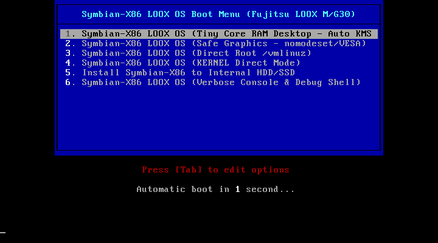
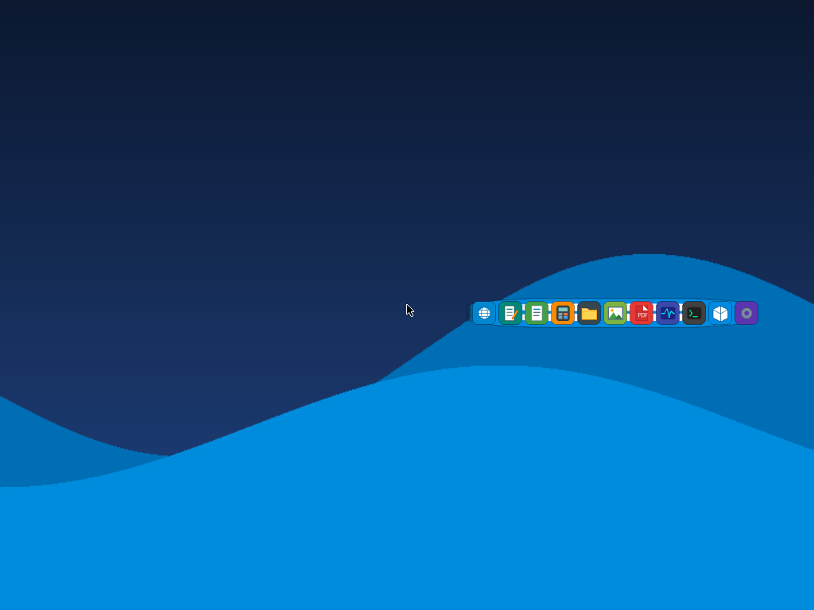
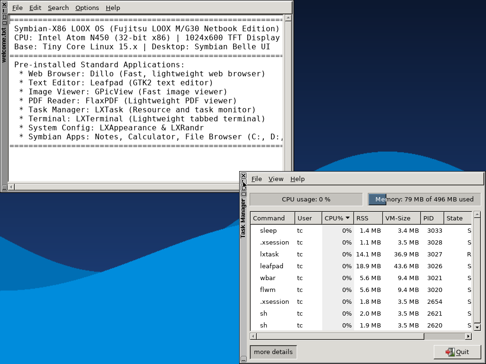

# Symbian-X86 LOOX OS

[](https://github.com/zessdemon12-sudo/symbian-x86-loox)
[-success.svg)](https://github.com/zessdemon12-sudo/symbian-x86-loox)
[](https://github.com/tinycorelinux)
[](https://github.com/zessdemon12-sudo/symbian-x86-loox)
[](https://github.com/zessdemon12-sudo/symbian-x86-loox/blob/main/LICENSE)
[](https://github.com/zessdemon12-sudo/symbian-x86-loox)

**Symbian-X86 LOOX OS** is a lightweight, high-performance operating system inspired by **Symbian OS** (Belle Netbook Edition), tailored specifically for the **Fujitsu FMV-BIBLO LOOX M/G30 Netbook** (Intel Atom N450 @ 1.66 GHz, 1024x600 TFT display, 1GB RAM) and legacy 32-bit x86 netbooks and PCs.

Rebased onto **Tiny Core Linux 15.x x86**, it runs 100% in RAM via `vmlinuz` + remastered `core.gz`, booting in under 2 seconds without disk `switch_root` failures or early boot kernel panics.

---

## Screenshots

### 1. BIOS Bootloader Menu (Syslinux)


### 2. Symbian Belle Desktop & Wbar Dock


### 3. Native Symbian Applications Running (Notes & Calculator)


---

## Key Features

- **Zero-Panic RAM Architecture:** Operates entirely in RAM with Tiny Core Linux 15.x x86 base, eliminating FAT32/USB timeout boot panics.
- **Ultra-Fast Boot:** Cold boots in ~1.8 seconds on Intel Atom N450 netbooks.
- **Symbian Belle UI Experience:**
  - Curved Symbian Belle wallpaper and Belle squircle application icon set.
  - Floating translucent bottom dock powered by `wbar`.
  - Lightweight window management via `openbox` and `flwm`.
- **Symbian OS Compatibility Layer (`/opt/symbian/`):**
  - C++ and Python 3 APIs for Active Objects, `CleanupStack`, `CenRep` (Central Repository), and `RProperty` (Publish & Subscribe).
  - SIS and SISX package management (`symbian-pkg` CLI + GUI).
- **Symbian Drive Architecture:**
  - `C:` -> User Home (`/home/tc`)
  - `D:` -> Removable Storage (`/media`)
  - `Z:` -> Symbian ROM (`/opt/symbian/rom`)
- **Native Symbian Applications:**
  - **Symbian Notes** (`symbian-notes`): Lightweight text editor with C:/D: storage.
  - **Symbian Calculator** (`symbian-calc`): Clean scientific/standard calculator.
  - **Symbian File Browser** (`symbian-filebrowser`): Symbian drive manager for C:, D:, Z:.
  - **Symbian Package Manager** (`symbian-pkg-gui`): Graphical installer for SIS/SISX packages.
  - **LOOX HDD Installer** (`symbian-installer`): One-click installer to internal netbook storage.
- **Fujitsu LOOX M/G30 Hardware Tuning:**
  - Atom N450 power scaling and thermal management (`loox-power-opt.sh`).
  - Dynamic resolution selection (native 1024x600 TFT panel or 1024x768 VESA fallback).

---

## Repository Structure

```
├── applications/             # Native Symbian applications (Notes, Calc, FileBrowser, AppManager)
│   ├── notes/
│   ├── calculator/
│   ├── filebrowser/
│   └── pkgmanager/
├── boot/                     # Bootloader configurations (Syslinux, ISOLINUX)
├── desktop/                  # Desktop configurations, LXQt, Openbox, Belle themes, and icons
│   ├── lxde/icons/Symbian-Belle/
│   ├── lxde/wallpaper/
│   ├── lxqt/
│   └── openbox/
├── docs/                     # Technical specifications and hardware guides
│   ├── screenshots/          # OS screenshots
│   ├── BUILD_GUIDE.md
│   ├── HARDWARE_LOOX_M_G30.md
│   ├── PACKAGE_FORMAT_SISX.md
│   ├── SDK_GUIDE.md
│   └── SYMBIAN_COMPATIBILITY_ARCH.md
├── installer/                # Internal drive installer GUI and scripts
├── kernel/                   # Atom N450 kernel configurations and initramfs scripts
├── packages/                 # Sample SIS / SISX application packages
├── scripts/                  # Master remastering and image generation pipelines
│   ├── remaster-tinycore.sh  # Unpacks, injects Symbian stack, and repacks core.gz
│   ├── build-usb-image.sh    # Builds 128MB FAT32 bootable USB disk image
│   └── build-iso.sh          # Builds bootable Hybrid ISO image
├── symbian/                  # Symbian C++ & Python compatibility layer
│   ├── api/                  # Active Objects, CenRep, CleanupStack, RProperty
│   └── package/              # SIS/SISX parser, installer, and uninstaller
├── tests/                    # Automated unit tests for Symbian APIs & package manager
├── tools/                    # SIS package build and signing utilities
├── build.sh                  # One-click master build orchestrator
├── make-usb.sh               # Direct physical USB flash utility
├── LICENSE                   # MIT License
└── PROJECT_LOG.md            # Detailed engineering log and architectural notes
```

---

## Getting Started

### Prerequisites (Debian/Ubuntu/Fedora/Arch Linux)

```bash
sudo apt-get update && sudo apt-get install -y \
    syslinux syslinux-utils isolinux xorriso dosfstools mtools \
    squashfs-tools libarchive-tools fakeroot cpio gzip wget curl
```

### 1. Master Build (Creates ISO & USB Image)

```bash
git clone https://github.com/zessdemon12-sudo/symbian-x86-loox.git
cd symbian-x86-loox
./build.sh
```

Build outputs are generated in the `output/` directory:
- `output/symbian-x86-loox-usb.img` (128 MB FAT32 bootable USB disk image)
- `output/symbian-x86-loox.iso` (43 MB Hybrid Live ISO)
- `output/boot/vmlinuz` & `output/boot/core.gz`

### 2. Flashing to Physical USB Drive

Insert your USB flash drive and run:

```bash
sudo ./make-usb.sh /dev/sdX   # Replace /dev/sdX with your target USB drive (e.g., /dev/sdb)
```

### 3. Booting on Fujitsu LOOX M/G30

1. Insert the prepared USB flash drive into the **Fujitsu FMV-BIBLO LOOX M/G30**.
2. Power on the netbook and press **F12** to enter the BIOS Boot Menu.
3. Select **USB HDD**.
4. The system boots into the Symbian-X86 Belle Desktop in ~2 seconds!

### 4. Running in QEMU Virtual Machine

```bash
qemu-system-i386 -drive file=output/symbian-x86-loox-usb.img,format=raw -m 512 -vga std
```

---

## License

This project is open-source and released under the [MIT License](LICENSE).
